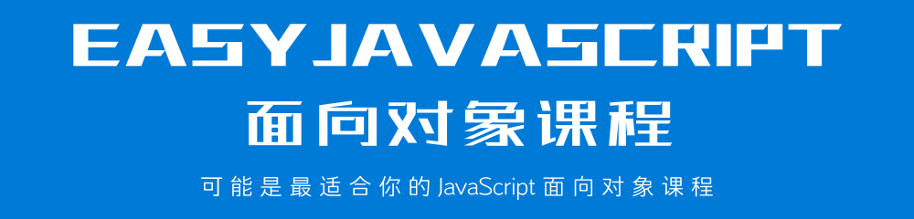

[使用 GitBook 在线阅读本课程](http://www.longestory.com/easy-javascript-oop/)

## 前言

本套课程共分为 12 个章节，从面向对象的概念到核心的语法，逐一详细的进行阐述。目的就是努力成为最好的 JavaScript 面向对象的自学课程。

> **本套课程会一直更新，直到达到适合于所有人自学为止。**

12 个章节内容，大体上可以被分为以下几个部分内容:

> **说明:** 如果你已经掌握 JavaScript 面向对象中的部分内容，可以根据自己的情况选择性的进行学习。

### 第一部分: 概念

我们首先从第一章节概念入手，先掌握什么是面向对象以及相关概念的含义。

这部分内容，是你学习 JavaScript 面向对象中后续内容的基础。概念清晰了，操作才会更顺手。学习概念，不仅仅只是单纯地阅读文字这么简单。要试着用自己的话来描述你所学习的概念，并把它发布到网络上，让别人替你检查，你的理解是否准确。

> 如果你不知道如何发布到网络上，可以加入底部的 QQ 讨论群，与其他人共同学习。

### 第二部分: 核心语法

从第二章到第五章，我们要掌握有关 JavaScript 面向对象的核心语法。这部分内容包含了 Object 对象、Function 对象、原型以及继承等内容。

这部分内容是 JavaScript 面向对象的核心内容。无论你是没有任何面向对象编程语言基础的开发者，还是具有任何其他面向对象编程语言基础的开发者，这部分内容都是非常难掌握的。原因在于 JavaScript 是一个基于原型实现的面向对象语言。

这部分内容，作者会不断地更新补充。尽量做到面面俱到，让你在学习之后可以全面地掌握 JavaScript 面向对象的核心语法内容。

> 你可以 **star** 或者 **watch** 本课程，这样一旦有更新，GitHub 会通知你。

### 第三部分: 内置对象

这部分内容是从第六章到第十章，我们要掌握有关 JavaScript 面向对象的内置对象。这部分内容包含了比较常见的内置对象，以及 Array 对象、RegExp 对象、String 对象和 Error 对象等内容。

JavaScript 的内置对象，又可以成为引用类型。这部分内容主要是讲解 JavaScript 内部提供的相关内容，主要以操作为主。所以，学习这部分内容，要尽量多地练习。

> 如果你在练习时遇到任何问题，可以加入底部的 QQ 讨论群，与其他人共同学习。

### 第四部分: this 关键字

这部分是第十一章，这一章节只有一个主题，就是 this 的用法。this 关键字在 JavaScript 语言中最复杂的机制之一，非常难理解。

所以，你在学习这部分内容时，要多理解概念、消化用法。

> 如果你不确定理解的概念是否准确，可以加入底部的 QQ 讨论群，与其他人共同学习。

### 第五部分: 严格模式

这是本套教程的最后一个内容，也是最后一个章节。JavaScript 语言是一个弱类型的编程语言，在 ECMAScript 5 版本后官方规范提供了严格模式。

目前，在实际开发中，严格模式也是比较主流的一种用法。这里主要需要注意对比非严格模式与严格模式之间的区别。

## 反馈

本套课程会尽量完善，编写过程中难免出现纰漏。你可以通过以下展示方式进行反馈，作者会根据反馈及时更新和修改。

## 交流

你可以扫描下方的二维码，加入本套课程的 QQ 讨论群，与其他童鞋一起学习交流。

## 版权

本套课程的文本内容免费开源，任何人都可以免费学习、分享，甚至可以进行修改。但需要注明作者及来源，并且不能用于商业。

本套课程采用<a rel="license" href="http://creativecommons.org/licenses/by-nc-nd/4.0/">知识共享署名-非商业性使用-禁止演绎 4.0 国际许可协议</a>进行许可。

 